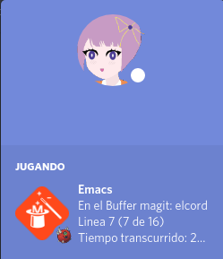

# elcord



## Discord Rich Presence for Emacs

Show off your emacs-savy ways to all your Discord friends and strangers.

This package will connect with a local Discord client to update your status via the Discord Rich Presence API.

## Installing

### Installing from MELPA

elcord is available from [MELPA](https://melpa.org/)

To install:
`M-x package-install RET elcord RET`

### Installation from Source

Simply place [elcord.el](elcord.el) file in a place Emacs can find it load/require it.

#### Note for Windows

Make sure that the [stdpipe.ps1](stdpipe.ps1) is in the same directory as the [elcord.el](elcord.el) file.

Talking with Discord's IPC mechanism is achieves through this PowerShell script to get around Emacs' inability to talk through named pipes on Windows.
Everything should work out-of-the-box. Just make sure this PowerShell script is installed in the same directory as your [elcord.el](elcord.el) file.

## Usage

After installing, enable `elcord-mode`.

Minimal init file:

``` emacs-lisp
(require 'elcord)
(elcord-mode)
```

There are customization options available.

Try
`M-x customize-group RET elcord RET`

## Icons

While the alist `elcord-mode-icon-alist` is customizable, all icon ID's are linked to the application pointed to by `elcord-client-id`.
If you'd like to request a new icon for a major mode be added, please open an [issue](../../issues).

### Custom Discord Application

Alternatively, you may create your own 'Application' with its own set of icons.

For creating an 'Application':
1. Visit Discord's [application page](https://discordapp.com/developers/applications/me/)
2. Create a new application and upload icons as a "small" asset.

After you've created your application, Customize `elcord-client-id` to be the new application's client ID,
and set the value of `elcord-mode-icon-alist` as appropriate to reference your new icons.
